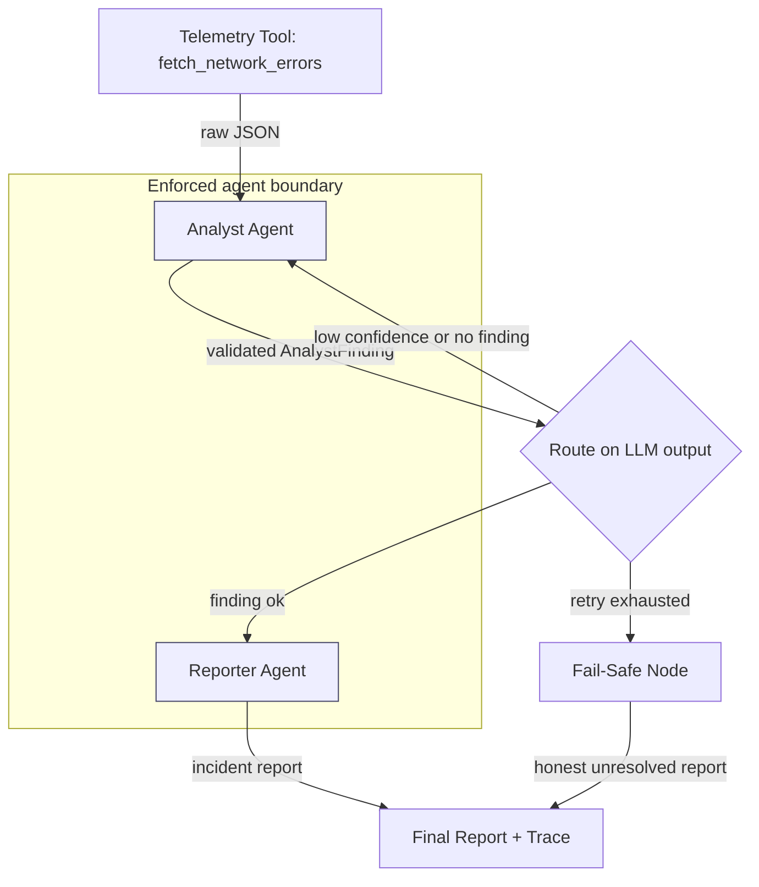

# Multi-Agent NOC Incident Triage

> A reference implementation of a multi-agent triage pattern.

A two-agent system that turns raw network telemetry into a professional incident report. An **Analyst Agent** invokes a telemetry tool, determines root cause, and emits a *validated* structured finding. A **Reporter Agent** consumes only that finding and produces the incident report. The two agents are decoupled by an enforced typed contract, with a bounded conditional, explicit failure handling, structured tracing, and a programmatic task-success metric.

**Runs in one command, with no API key.** A deterministic mock provider is the default, so the entire system — including the success metric and tests — is reproducible offline.

---

## Architecture



- **Telemetry tool** — synthetic, deterministic, agent-invoked (genuine tool-use).
- **Analyst Agent** — its *only* output is a validated `AnalystFinding`.
- **Conditional router** — one bounded loop: low-confidence/no-finding triggers at most one re-analysis, then proceeds or fails safe.
- **Reporter Agent** — receives *only* the finding; structurally cannot see raw telemetry.
- **Fail-Safe** — produces an honest "unresolved" report instead of crashing or fabricating a router id.

## Quickstart

```bash
# 1. environment (uv)
uv venv --python 3.11
source .venv/bin/activate
uv sync                 # core; add --extra dev for tests, --extra openai for a real LLM

# 2. run one triage (mock provider, no key, deterministic)
python main.py --scenario incident-42

# 3. report only (trace goes to stderr)
python main.py --scenario incident-42 2>/dev/null

# 4. the task-success metric
python main.py --metric

# 5. tests
pytest -q
```

To use a real model instead of the mock: copy `.env.example` to `.env`, set
`LLM_PROVIDER=openai` and `OPENAI_API_KEY`. No code changes.

## Design Decisions & Trade-offs

The reasoning matters more than the code here, so it is explicit:

- **Typed handoff contract in its own module (`handoff_contract.py`).** The
  agent boundary is enforced by the type system, not convention. The Reporter's signature accepts only an `AnalystFinding`; it has no import path to the tool. This is what makes the agents independently testable and swappable.
- **One bounded conditional, not an elaborate graph.** The rubric asks for
  conditional logic on LLM output; it does not ask for graph virtuosity. A single, clearly-visible, *bounded* retry demonstrates the skill while avoiding the dominant failure mode of agentic systems — unbounded loops that silently multiply cost and latency. Retry cap = 1, hard.
- **Fail-fast on an unidentifiable router.** When telemetry doesn't permit a real router id, the Analyst *refuses* to emit a placeholder. For a triage tool, surfacing a fabricated identifier downstream is worse than honestly reporting "manual investigation required."
- **Deterministic mock provider as the default.** Reproducibility and
  zero-setup runnability beat a flashy demo that needs a key. The mock is rule-based, not random, so the success metric and tests are stable in CI.
- **Resilience as a small dedicated module, not scattered try/except.** Bounded retry, timeout, and explicit None-guards are reusable and tested in one place.
- **Provider behind a Protocol.** Vendor choice is one config value; agents
  never import a vendor SDK. Any vendor exception is normalized to
  `ProviderError` so it cannot leak into agent logic.

## Out of Scope — Deliberately

Right-sizing is part of the engineering. The following were consciously
**excluded** because the brief is a bounded two-agent triage task, and adding them would signal poor scoping, not capability:

- **Vector DB / RAG** — Scenario 2 has no retrieval requirement. A vector store here would be machinery with no scored value and added failure surface.
- **Auth / user management / UI** — not in this scenario's scope (UI was
  Scenarios 3 & 4). A CLI entrypoint is more robust and sufficient.
- **Containerization / distributed services / CI runners** — over-engineering for a 6-hour bounded task; the rubric explicitly rewards minimal, composable design.

How each would extend in production, if this graduated to a real service:

- *Retrieval:* a runbook/knowledge RAG path the Reporter could cite, behind the same provider interface.
- *Auth & multi-tenant:* request-scoped identity + per-tenant trace isolation.
- *Scale:* the graph is stateless per run; horizontal scaling needs only a shared checkpointer and a queue in front of the entrypoint.
- *Observability:* `observability.emit()` is the single integration point —
  point it at OpenTelemetry / LangSmith; no agent code changes.

This combination — building exactly the bounded scope *and* articulating the production path — is the intended demonstration of judgment.

## Repository Layout

```
main.py                     one-command entrypoint (stdout=report, stderr=trace)
src/provider.py             ModelProvider Protocol + deterministic mock + OpenAI
src/tool_network_data.py    synthetic, deterministic, agent-invoked telemetry tool
src/handoff_contract.py     the enforced Analyst -> Reporter typed contract
src/agent_analyst.py        tool-use + root cause + fail-fast guards
src/agent_reporter.py       consumes ONLY the finding; isolated from raw data
src/graph.py                LangGraph wiring + the one bounded conditional
src/resilience.py           bounded retry / timeout / None-guard primitives
src/success_metric.py       the task-success metric (scored, deterministic)
src/observability.py        structured JSON decision trace
tests/                      success-metric tests + fault-injection tests
docs/EVALUATION_LOG.md      metric result + fail-fast rationale
```

## Evaluation

See [`docs/EVALUATION_LOG.md`](docs/EVALUATION_LOG.md). Summary: the task-success
metric scores **5/5** deterministically — three normal cases carry the Analyst's router id through to the report; two failure cases (empty / malformed telemetry) correctly decline without fabricating a router. `pytest -q` runs 13 tests including system-level fault injection (total model failure, empty/malformed telemetry, retry-bound, timeout).

## Data

All telemetry is **synthetic** and generated deterministically in
`src/tool_network_data.py`. No real or proprietary data is used.
